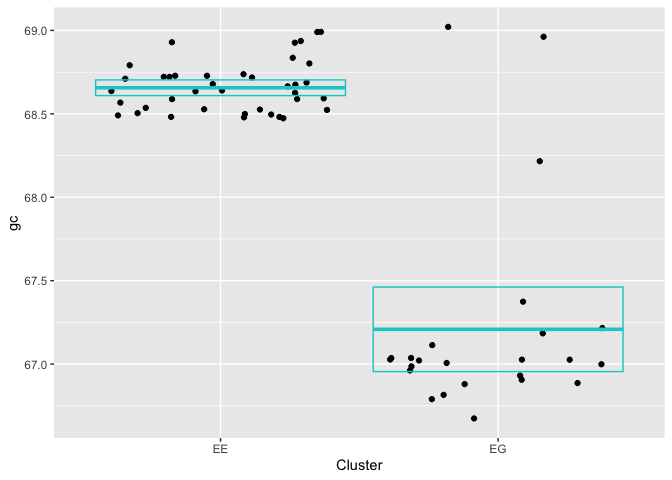
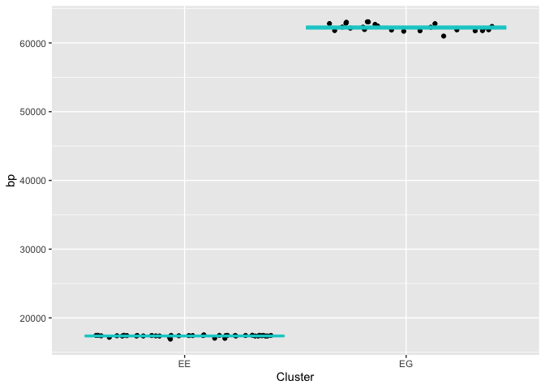

# Comparing the Differences in Genetic Cntent between Bacteriophages in Different Clusters.

Ethan Dotzler

Biosciences Department, Minnesota State University Moorhead, 1104 7th
Avenue South, Moorhead, MN 56563 USA

Presented at the MSUM 23rd Online Student Acadmic Conference

Submit a survey for this presentation:
<https://mnstate.co1.qualtrics.com/jfe/form/SV_eFMAwF72JZIoeSq>

## Abstract

Bacteriophages are viruses that are capable of infecting specific
bacterial hosts, and they stand as one of the most fascinating research
topics today. Due to their ability to affect specific hosts, this means
that each phage that is discovered is truly unique; no two phages are
completely alike. For this project, I want to statistically quantify
what the differences between phages in a similar Cluster looked like. I
will use the Clusters of EG and EE, as they are both capable of
infecting the host Microbacterium foliorum. For each Cluster, The data
and FASTA files for these phages will all be accessible and downloaded
through the Actinobacteriophage Database. Using exploratory data
analysis, I will compare each phage to one another in a cluster, to
compare the genetic differences between them. I will also compare these
results to the phages in the other cluster, to see the genetic
differences between the separate clusters. The results from this data
analysis could be used to continue quantification of phage differences,
and to compare differences between cluster and host differences.

## Introduction

DNA is one of the most important building blocks in the world, being the
basis for all living organisms. An example of an organism that uses its
own DNA to its advantage is a bacteriophage, a virus that is capable of
infecting a host bacterial cell (Pittsburgh Bacteriophage Institute,
2010). There are many phages around the world, each of them being placed
into a category called Clusters. There are lots of different clusters
for phages to be placed into, and each cluster is different from one
another. In this project, I aim to show the differences between phages
in different clusters, and potentially even show differences between
phages within the same cluster.

## Methods

For this project, I used R and RStudio to work and edit the data in
order to create graphical outputs from the data. References for these
are in the Literature Cited section.

To begin, I first downloaded an RStudio library called readxl, which
allowed me to read data from a Microsoft Excel spreadsheet (Wickham &
Bryan, 2019). Once the readxl library was ready, I was ready to load all
of the data from PhagesDB (Pittsburgh Bacteriophage Institute, 2010)
into the spreadsheet, which was then able to be read into RStudio.

Once the data had been loaded, I tested the data set by finding the
sample size, the mean, the standard deviation, the variance, the
Standard Error of the Mean (SEM), and the upper and lower confidence
intervals. Using this data, I made graphs that displayed the mean and
used the SEM and confidence intervals to make error bars. Graphs were
made using the ggplot funtion (Wickham, 2016).

## Results

    ## # A tibble: 63 x 6
    ##    phage        host           Cluster subcluster    bp    gc
    ##    <chr>        <chr>          <chr>   <chr>      <dbl> <dbl>
    ##  1 ManAs        Microbacterium EE      None       17362  68.5
    ##  2 Jannah       Microbacterium EE      None       17428  68.6
    ##  3 BrokMonster  Microbacterium EE      None       17433  68.9
    ##  4 MrGreen      Microbacterium EE      None       17421  68.6
    ##  5 Josuke       Microbacterium EE      None       17453  68.7
    ##  6 Leafy        Microbacterium EE      None       17407  68.7
    ##  7 Eightball    Microbacterium EE      None       17439  68.7
    ##  8 Pondwater    Microbacterium EE      None       17362  68.5
    ##  9 Yasuo        Microbacterium EE      None       17433  68.7
    ## 10 Anseraureola Microbacterium EE      None       17425  68.7
    ## # … with 53 more rows

    ## # A tibble: 2 x 8
    ##   Cluster sampl_size mean_gc str_dev    var    sem ci_upper ci_lower
    ## * <chr>        <int>   <dbl>   <dbl>  <dbl>  <dbl>    <dbl>    <dbl>
    ## 1 EE              39    68.7   0.147 0.0215 0.0235     68.7     68.6
    ## 2 EG              24    67.2   0.621 0.385  0.127      67.5     67.0

    ## # A tibble: 2 x 8
    ##   Cluster sampl_size mean_bp str_dev     var   sem ci_upper ci_lower
    ## * <chr>        <int>   <dbl>   <dbl>   <dbl> <dbl>    <dbl>    <dbl>
    ## 1 EE              39  17372.    130.  16954.  20.8   17414.   17331.
    ## 2 EG              24  62242.    529. 279735. 108.    62458.   62026.

<!-- --><!-- -->

## Discussion

The results of the graphs show that you can make a prediction of whether
a phage will be in Cluster EE or Cluster EG based off of the GC% and the
number of Base-Pairs. The data from the GC% graph shows that a large
number of phages within the different clusters share a similar GC%,
however there are a few points that screw the data because they have a
larger percentage than other phages in the cluster. A few examples of
this are the phages in the CLuster EG that have a GC% of around 69%,
which is far from the confidence area for that cluster. The data from
the Base-Pair graph shows that the phages in the same cluster possess a
very similar number of base-pairs, suggesting that this trend is shared
throughout all phages in the cluster. If this is true for phages in
clusters other than the ones tested here, this could help further
distinguish the different clusters and help researchers determine which
clusters phages belong in based off of their base-pair counts.

## Literature Cited

Hadley Wickham and Jennifer Bryan (2019). readxl: Read Excel Files. R
package version 1.3.1 <https://CRAN.R-project.org/package=readxl>

H. Wickham. ggplot2: Elegant Graphics for Data Analysis. Springer-Werlag
New York, 2016.

Pittsburgh Bacteriophage Institute. (2010, April). PhagesDB.
<https://phagesdb.org/>

R version 4.0.3 (2020-10-10)

Rstudio versioni 1.4.1106 RStudio Team (2021). RStudio: Integrated
Development Environment for R. RStudio, PBC, Boston, MA URL
<http://www.rstudio.com/>
